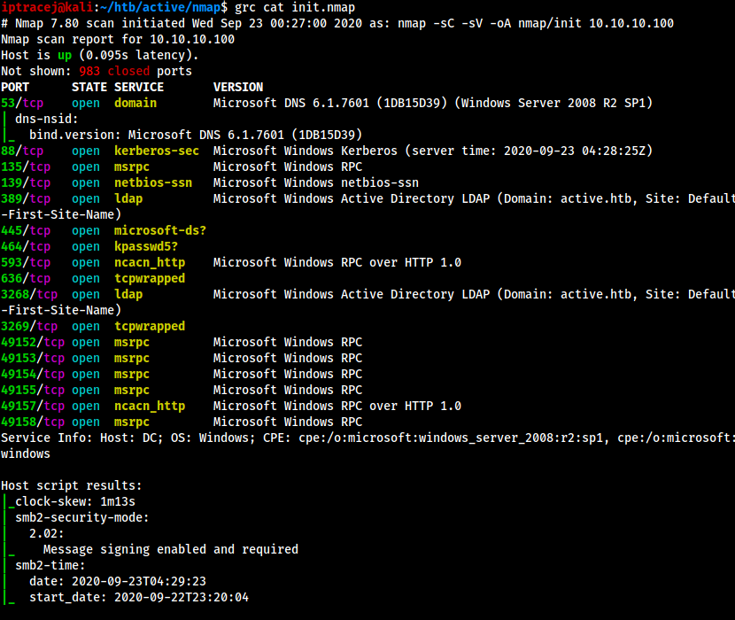

# color-nmap-console

Sample config files showing how to colorize the output of nmap

### How to install it 

For Kali and debian based system,
    
    sudo apt-get install grc

For others, visit the site, https://github.com/pengwynn/grc

### How to use it 
 
By default, grc supports nmap to colorize the output

    >grc nmap -sC -sV -oA nmap/init 10.10.10.1

To look at the saved nmap file, add the following configuration to the end of /etc/grc.conf

    # nmap file
    \b\w+\b.*nmap\b
    conf.nmap

    \b\w+\b*nmap.txt\b
    conf.nmap

Run grc cat command

    >grc cat init.nmap 
    >grc cat _full_tcp_nmap.txt

Two quick improvements: 
  - You may want to use less command (let me know if you find it) or tmux session to scroll the screen back and forth. 
  - You may want to customize /usr/local/share/grc/conf.nmap

### Screenshot

### Todo

Map the output to hack the box, vulnhub, tryhackme, and any other vulnerable boxes to help quickly analyze juicy entry points 

### License

MIT  

